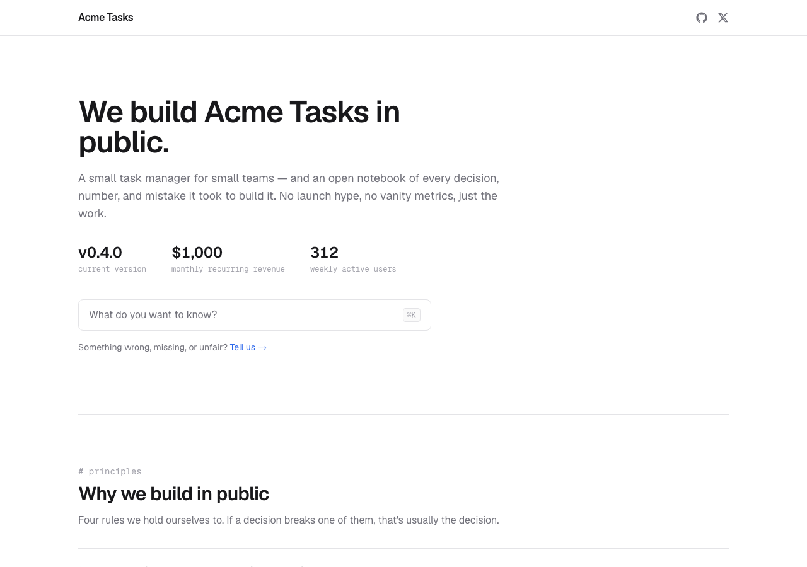

# Building in Public Template

[](https://x.com/mativallej_)
[](https://github.com/mativallej/building-in-public-template/search?l=typescript)


> An open-source Next.js template for building your product in public: manifesto, dev log with long-form articles, changelog, roadmap, business model, live-editable metrics, monthly updates, team, and a ⌘K command palette. No CMS, no database, no environment variables.



**[Live demo](https://building-in-public-template.vercel.app)** · **[Showcase: tegu.ar/building-in-public](https://tegu.ar/building-in-public)** — the real page this template was extracted from.

## Introduction

**Building in Public Template** is a static-first Next.js page you clone, personalize, and deploy. It turns "building in public" into a real artifact: one opinionated page plus article subpages, all driven by typed data files — no CMS, no backend, no environment variables. `npm run build` works on a fresh clone with nothing configured.

**Two ways to make it yours:**

- **Claude Code** – Run the embedded `/bip-setup` skill. It interviews you and writes `site.config.ts` plus every data file with your real content.
- **By hand** – Edit `site.config.ts` and the files in `src/data/`. That's the whole job; no components to touch.

Once personalized, the page renders your manifesto, a terminal-style dev log, a filterable changelog, a qualitative roadmap, your business model, a live-editable metrics grid, monthly updates, your team, and a ⌘K command palette to jump anywhere.

## Key Features

- **Static-first** – No server actions, no database, no env vars. Deploys anywhere Next.js runs.
- **One personalization point** – `site.config.ts` plus nine typed data files. Change the accent color with a single edit.
- **"Plain" design system** – A quiet, flat, editorial look built on a handful of CSS custom properties. Geist Sans + Geist Mono.
- **Command palette** – A ⌘K menu that indexes every section, article, and changelog entry.
- **Dev log + long-form articles** – A terminal-style log with markdown articles (GFM tables, path-traversal-safe loader, JSON-LD).
- **Editorial guardrails** – Embedded skills enforce the rules: real numbers, published failures, no unannounced launches.
- **Claude Code skills** – `/bip-setup`, `/bip-devlog`, and `/bip-ship` for setup and ongoing authoring.
- **MIT licensed** – A small, removable attribution footer, on by default.

## Quick Start (Recommended)

The fastest path uses [Claude Code](https://claude.com/claude-code) and the embedded setup skill.

### Prerequisites

- [Node.js](https://nodejs.org/) 18.18+ (20+ recommended) and npm.
- A [GitHub](https://github.com/) account (to host your repo).
- A [Vercel](https://vercel.com/) account for deploy (optional — any Next.js host works).

### Steps

1. **Clone the repository** (or click "Use this template" on GitHub)
   ```bash
   git clone https://github.com/mativallej/building-in-public-template.git my-page
   cd my-page
   npm install
   ```

2. **Personalize it with Claude Code**
   ```
   /bip-setup
   ```
   The skill interviews you (product, story, principles, first metrics, socials, accent color) and writes `site.config.ts` plus every data file with your real content — including your first dev-log entry.

3. **Preview locally**
   ```bash
   npm run dev
   ```
   Open http://localhost:3000.

4. **Deploy**

   Push to GitHub and import the repo on [Vercel](https://vercel.com/new) (Next.js preset, zero env vars). Done.

### Local Development

```bash
# Start the dev server (hot reload)
npm run dev

# Production build (run this before deploying)
npm run build

# Serve the production build locally
npm run start
```

## Alternative Setup (Manual, no Claude Code)

You don't need Claude Code — everything is plain files.

### Steps

1. **Clone and install** (same as above).
2. **Edit `site.config.ts`** – name, URL, tagline, subtitle, accent color, socials, hero facts, and the terminal's custom commands.
3. **Edit the data files** in `src/data/` – replace the "Acme Tasks" placeholder content with your own (keep the types and the newest-first ordering intact).
4. **Write your articles** in `content/devlog/{slug}.md` – and link them from `src/data/devlog.ts` with a matching `slug` and `hasArticle: true`.
5. **Build and deploy** – `npm run build`, then import on Vercel.

Dates accept `"YYYY-MM"` (month precision) or `"YYYY-MM-DD"`.

## Detailed Setup (Developers)

### Tech Stack

- **Next.js 16** (App Router) + **React 19**
- **TypeScript** (strict)
- **Tailwind CSS 4** (`@import "tailwindcss"` + tokens in `globals.css`)
- **gray-matter** + **remark / remark-gfm / remark-html** for articles
- **clsx** + **tailwind-merge** for class composition
- No icon library, no animation library, no UI kit — text glyphs and inline SVGs only.

### Project Structure

```
building-in-public-template/
├── site.config.ts              # THE single personalization point
├── content/devlog/             # long-form articles (*.md, gray-matter)
├── src/
│   ├── app/                    # layout, page, [slug] article route, globals.css
│   ├── components/             # Terminal, Timeline, MethodStack, CommandMenu, …
│   ├── data/                   # nine typed data files (one per section)
│   └── lib/                    # articles loader, dates, sections registry, cn
├── docs/screenshot.png
└── .claude/skills/             # bip-setup, bip-devlog, bip-ship
```

### Customization

1. **Accent color** – Change `accent` in `site.config.ts` (any hex). It's injected as `--bip-accent` and recolors links, focus rings, active filters, and the solid button. No other edits.
2. **Fonts** – Geist Sans + Geist Mono via `next/font`. Swap them in `src/app/layout.tsx`.
3. **Sections** – The page is assembled in `src/app/page.tsx` from a `SECTIONS` registry (`src/lib/sections.ts`) that also feeds the command palette. Reorder or drop sections there.
4. **Design tokens** – The whole "Plain" system is a handful of CSS custom properties at the top of `src/app/globals.css`.
5. **Article frontmatter**

   | Field | Type | Notes |
   | --- | --- | --- |
   | `title` | string | Falls back to the slug. |
   | `description` | string | Used for `<meta>` and OG. |
   | `date` | string | `YYYY-MM-DD`. |
   | `version` | string | Optional, e.g. `v0.4.0`. |
   | `tags` | string[] | Freeform. |
   | `author` | `{ name, role }` | Falls back to the config name. |

## Data Model

All content lives in one config file, nine typed data files, and your markdown articles. No components to edit.

| File | Contents |
| --- | --- |
| `site.config.ts` | Name, URL, tagline, accent, socials, hero facts, terminal commands. |
| `data/principles.ts` | The manifesto (3–5 items). |
| `data/devlog.ts` | Decisions, newest first. `failed: true` renders a ✗; `hasArticle: true` links to an article. |
| `data/changelog.ts` | Shipped items with an `area` for filtering. |
| `data/methods.ts` | Frameworks you use, with named sources and a `category`. |
| `data/roadmap.ts` | Exactly three columns: Now / Next / Someday. |
| `data/metrics.ts` | The public numbers. `tone: "accent"` highlights a value. |
| `data/business.ts` | How you make money, plus the metrics you commit to publish. |
| `data/updates.ts` | Monthly recaps, newest first. |
| `data/team.ts` | The people. Photo optional (initials otherwise). |

Category-like fields (`area`, `category`) are plain strings — define your own. Filter options derive from the data automatically.

## Architecture Overview

### The Page

`src/app/page.tsx` is a static server component assembled from a `SECTIONS` registry that feeds both the anchors and the command palette. Sections, in order: hero + ⌘K palette, principles, method, dev log, changelog, roadmap, business model, the numbers, monthly updates, team, follow.

### The Article System

Markdown in `content/devlog/{slug}.md` is loaded by a `server-only` module with a path-traversal guard, rendered through remark (GFM + raw HTML), and post-processed to strip empty stat-table headers and make wide tables scrollable. The `[slug]` route generates static params from disk (minus hidden slugs), 404s hidden or missing entries, and emits BlogPosting + BreadcrumbList JSON-LD.

### Static-First

No server actions, no database, no environment variables. Metrics are a static data file (v1); wiring them to a live source with ISR is documented below as a v2 path.

## The Editorial Rules

The whole point is a page you can't fake. The embedded skills enforce these; you should too:

1. **Real numbers or nothing.** No invented or flatteringly-rounded metrics.
2. **Publish the failures.** That's what `failed: true` is for — a log of only wins is marketing.
3. **No unannounced launches.** Don't tease features that don't exist.
4. **No competitor names**, and no third-party people or companies without their consent.
5. **Every decision should be defensible in public.** If a number can't survive a question, it doesn't go on the page.

## Usage

### Claude Code Skills

Three skills ship in `.claude/skills/`. They write data and markdown directly and never touch components.

- **`/bip-setup`** – Interviews you and personalizes the whole site (config + data + your first dev-log entry).
- **`/bip-devlog`** – Guided authoring of a dev-log entry or a full article, with the editorial rules baked in.
- **`/bip-ship`** – Reads your product repo's recent git history and drafts changelog entries for you to approve.

### Writing a dev log entry by hand

1. Prepend a `DevlogEntry` to `devlogEntries` in `src/data/devlog.ts` (newest first).
2. Mark misses with `failed: true`.
3. For a long-form piece, create `content/devlog/{slug}.md` and set `hasArticle: true` with the matching `slug`.

## Contributing

Contributions are welcome.

- **Sites using this template** – Shipped a page with this? Open a PR adding it to the list below.
- **v2 ideas** (deliberately out of v1, welcome as PRs):
  - **Live metrics** – Wire `metrics.ts` to a real data source with ISR instead of editing by hand.
  - **Dark mode** – The tokens are centralized; a `prefers-color-scheme` pass is a small, welcome addition.

**Sites using this template**

- [tegu.ar/building-in-public](https://tegu.ar/building-in-public) — the original.

## Contact

Built by Matías Vallejos.

- Website: [matiasvallejos.com](https://matiasvallejos.com)
- X: [@mativallej_](https://x.com/mativallej_)
- GitHub: [@mativallej](https://github.com/mativallej)

## License

[MIT](LICENSE). The footer carries a small "Built with the Building in Public Template" attribution by default. It's removable — set `attribution: false` in `site.config.ts` — but leaving it on is appreciated and helps others find the template.

## Inspiration

Building in public works best when the artifact outlives the tweet. This template was extracted from a real page — [tegu.ar/building-in-public](https://tegu.ar/building-in-public) — so the format is proven, not theoretical. The placeholder product ("Acme Tasks") is entirely fictional; the template teaches the format, and the showcase demonstrates the reality.
